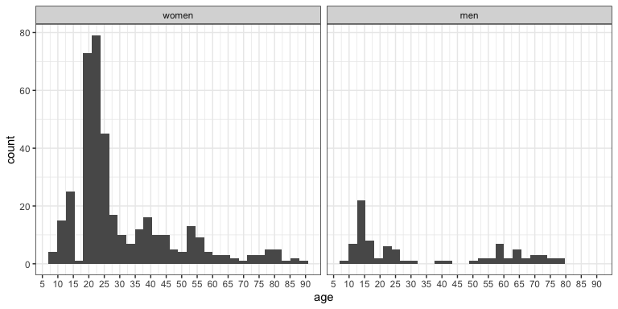
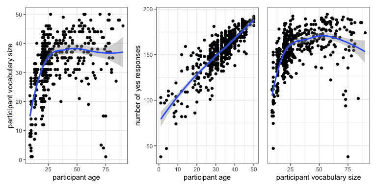
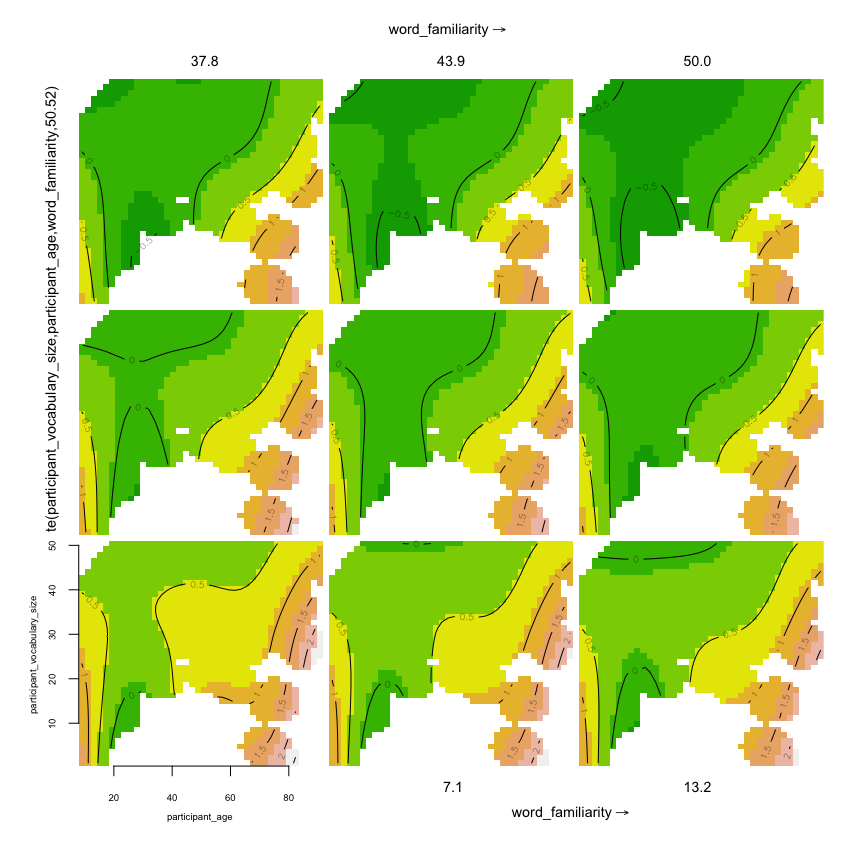
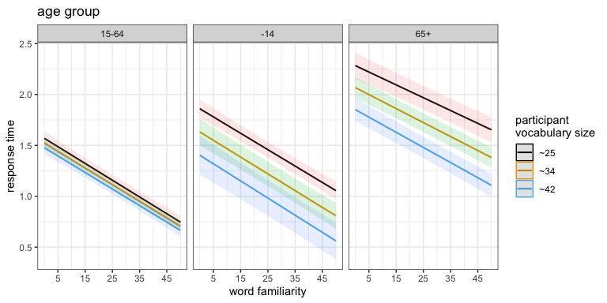

This is the supplementary information to the paper “Participants
something something vocabulary something something age something
something lexical decision task”.

## Links

The lit review is
[**here**](https://docs.google.com/document/d/1I3r6fjOtjBF95PoaWLjYHcfncjogV2s-gm3Kdo4bSF0/edit?usp=sharing).

The ms is
[**here**](https://docs.google.com/document/d/1PGReJcHZ-a-8hOUA-bW_4K0QnhcUrDkmvvFpVhzc5A4/edit?usp=sharing).

The code to run the experiments on Gitlab for pilot 1, pilot 2, and the
main experiment are
[**here**](https://gitlab.pavlovia.org/petyaraczbme/lex_span4),
[**here**](https://gitlab.pavlovia.org/petyaraczbme/lendulet_bme_szokiserlet_vegso),
and
[**here**](https://gitlab.pavlovia.org/petyaraczbme/lex-dec-task-random).

## File structure and workflow

We ran two pilot experiments and a main experiment. In the paper, we
mostly talk about the main experiment and don’t like talking about pilot
1 and 2, much like people do about [the East Pole and the West
Pole](https://standardebooks.org/ebooks/a-a-milne/winnie-the-pooh/text/chapter-9).

The stimulus list for pilot 1 was based on a frequency list from
[Hungarian Webcorpus 2](https://hlt.bme.hu/en/resources/webcorpus2). We
host this list in this repository. Cite us and the original if you want
to use it. Subsequent stimulus lists were based on results from pilot 1.

-   src: corpus data in various processed forms
-   raw: raw output of the Gitlab scripts running the experiments
-   scripts: scripts to create the word lists, process the raw data,
    create the tidy data, and check on the processing
-   tidy: tidy data for pilot 1, 2, and main
-   analysis: scripts to analyse the tidy data from the main experiment

## The main experiment

### Research questions

1.  Does participant vocabulary size predict response time to visual
    word targets in a homogeneous participant sample?
2.  Does participant age predict lexical decision times?
3.  How do participant vocabulary size, participant age, and the
    relative familiarity of a word target interact in predicting
    response times by a participant to a word target?

### Stimuli

We used real Hungarian words and nonce words in the main experiment. For
real words, 900 word forms were sampled from a frequency dictionary
built from a web-crawled and morphologically disambiguated corpus of
Hungarian (Nemeskey (2020)). The corpus contains cca. 9 billion forms.
For nonce words, we used a spelling dictionary (Szabó and Kovács (2018))
with a low-frequency cutoff to generate ngram models of valid Hungarian
forms. We used these models to generate words of varying length and then
hand-filtered the resulting list to arrive at a list of 300 nonce words.

A separate baseline experiment (our pilot 1) was used to benchmark our
stimuli. The word list of 1200 (900 real + 300 nonce) forms was split in
50 frequency bins of 24 (18 real + 6 nonce) forms each based on log
frequency for real words and at random for nonce words. Words were
displayed in a lexical decision task in decreasing order of bins (from
more frequent to less frequent) for each participant. Participants had
to say “yes” the word if they were familiar with it or say “no” if they
were unfamiliar with it or did not think it to be a word in Hungarian.
Participants responded using the keyboard. They were instructed to be as
fast as possible. A subset of words was sampled at random for each
participant. The experiment was coded in Psychopy and run online on
Pavlovia (Peirce (2007)).

The step-wise design was built on earlier work, such as (Hintz et al.
(2020),Wolf et al. (2021)). We are grateful for the substantive feedback
given by Florian Hintz. Participants were to encounter gradually more
difficult stimuli, and the experiment terminated if they rejected too
many words in a given difficulty bin. In practice, the vast majority of
our participants reached the most difficult bin, indicating that the
original design was not sufficiently challenging for this sample.

404 participants completed the baseline experiment (305 women, median
age = 21) in mid 2020. We collected 19-60 responses per word, with a
median of 37.

For real word targets, the log odds of “yes” / “no” answers correlated
with the word’s log frequency (r = .56). We fit a regression model
predicting the log odds of “yes” / “no” answers from the word’s
frequency bin. Visual inspection of the model residuals revealed an
outlier region of words that were comparatively rare in the corpus but
participants knew them all the same. We used the residuals to exclude
around 20% of words which fell in this category, that is, which received
much more “yes” answers than predicted by their frequency bin. We did
this for both the overall distribution and the individual frequency
bins. We ordered the remaining words by the log odds of accept / reject
answers (that is, their familiarity to the participant sample in the
baseline experiment), split the set into 50 bins, and sampled 4 real
words from each bin.

Subjective familiarity and word frequency are never a perfect match,
especially in the written domain (Colombo, Pasini, and Balota (2006)).
Some less common words are used in specific contexts while others are
more evenly distributed (see our example of ‘lymphatic’ and
‘mantelpiece’ from earlier), compounds (like ‘darkroom’ or ‘blackbird’)
might be primed by their constituents, some words are harder to parse
than others, etc. We wanted to create stimuli that are a better fit for
the expectations of our participant sample, which is why we used
participant responses to calibrate word familiarity.

For nonce words, we sorted these across the ratio of correct answers
(saying “no” to the word) and took the two-thirds with which
participants were most accurate (in recognising that the word was not a
real word in Hungarian). We sampled 50 forms from this set. Due to a
sorting error, the stimulus set ended up with 199 real words and 51
nonce words.

The end result was a set of 250 words, with 199 real words split across
50 familiarity bins and 51 nonce words. Real words were singular nouns,
adjectives, and 3sg. present verbs, containing 2 or 3 syllables. They
each had a familiarity score between 1 and 50, predicated on responses
in a baseline experiment (as detailed above). Nonce words matched real
words in length and make-up, and were rated as sufficiently distinct
from real words in the baseline experiment. These words were used in the
main experiment.

List of nonce words in stimuli:

> “abeti, aragas, aurult, cséltás, csenyei, dohorpák, egant, ernyak,
> extuál, gyásos, hider, hitódó, jegedény, karnogó, kelől, kilukát,
> kocskesi, konyrúd, kosi, kunyai, lemesség, lublika, megpadék,
> méhezter, mihálóz, norvend, novagár, összalaj, ószeven, parkkói,
> pentez, retálhit, retta, rojtoz, rozintem, storítő, szabotró,
> szelégül, szimboló, tajtásos, takorák, tömzsa, tortya, tröshet,
> úszamos, vároló, vényegő, vésségi, vetézmés, vonzum, zomogyi”

List of real words in stimuli, from most to least familiar:

> “pohár (glass), extrém (extreme), törődik (cares), ellenfél
> (opponent), időszak (period), eszköz (tool), alkalom (occasion),
> szegény (poor), közhely (cliché), rejtőzik (hiding), tartalom
> (content), mítosz (myth), karakter (character), dolog (thing),
> törékeny (fragile), barát (friend), példakép (role model), gazdag
> (rich), profit (profit), kötődik (bound), dolgozik (work), lélek
> (soul), hatalom (power), hajlik (bend), gyűjtemény (collection), beton
> (concrete), jármű (vehicle), keresztény (Christian), könnyelmű
> (frivolous), űrlap (form), töredék (fragment), irány (direction),
> végbél (rectum), százalék (Percent), reagál (responds), örmény
> (Armenian), égitest (celestial body), ausztrál (Australian), régész
> (archaeologist), század (century), bélyeg (stamp), pereg (slick),
> nagyszámú (numerous), hálózsák (sleeping bag), tábornagy (Field
> Marshal), diktátor (dictator), balközép (centre left), kárpit
> (tapestry), komoly (serious), csatázik (battle), piktogram
> (pictogram), kislány (girl), sárgaréz (brass), csengettyű (bell),
> délceg (proud), kulcscsont (clavicle), komplex (complex), hidroxid
> (hydroxide), sugár (ray), igény (demand), iszlám (islam), olaj (oil),
> újgazdag (nouveau riche), nárcisz (narcissus), árus (vendor), szempont
> (aspect), rakódik (stack), sporthorgász (sport fisherman), tenger
> (sea), rövid (short), forgórész (rotor), csontdarab (bone fragment),
> fürkész (scan), orális (oral), látszik (seems), ómagyar (old
> Hungarian), tarol (sweep), színpad (stage), elegy (blend), horizont
> (horizon), darab (piece), nagybeteg (gravely ill), lépték (measure),
> ború (dour), selypít (lisp), kanalaz (spoon), glükóz (glucose), lágyék
> (crotch), népszerű (popular), sziszeg (hiss), grafikon (graph),
> változik (varies), luftballon (balloon), biliárd (billiards), gyapot
> (cotton), mellényzseb (vest pocket), tököl (fiddle), gyülemlik
> (accumulates), nyersarany (raw gold), testnedv (bodily fluid), referál
> (refer), csüggeszt (discourage), tangózik (tango), turné (tour),
> heveny (acute), derít (settle), hidegház (cold storage), viszkózus
> (viscous), lukaszt (aperture), puritán (puritan), reform (reform),
> nukleon (nucleon), kalcium (calcium), bacon (bacon), nimbus (nimbus),
> transzplantál (transplant), szalicil (salicyl), viszkóz (viscose),
> szokik (habituates), csüggedez (dispirited), abszint (absinthe),
> tropikus (tropical), kitin (chitin), szilikát (silicate), arzénsav
> (arsenic acid), bolgár (Bulgarian), ion (ion), gerencsér (lucky),
> svábtök (Solanum tuberosum), skubizik (scubic), komál (sympathise),
> kettősfém (bimetal), püffeszt (bloat), kondenzcsík (contrail), csapdáz
> (trap), anorák (anorak), lakotthely (dwelling place), koenzim
> (coenzyme), rücsök (jerk), bárányfark (Amaranthus caudatus), kurtít
> (curtail), genom (genome), csapattest (corps), neoprén (neoprene),
> árstop (driftstop), farkasbab (Lapinus luteus), konverzál (converge),
> törköly (dwarf), pauzál (pause), fertilis (fertilis), dádá (dada),
> kencéz (kencéz), alfél (bottom half), fajansz (faience), rotor
> (rotor), kúpol (cone), bizmut (bizmut), donhuán (donhuan), lazúroz
> (loose), káder (cadre), templomoz (temples), bajuszfű (Crypsis
> schoenoides), lejmol (scrounge), kurzív (cursive arch), türemlik
> (protrude), dipeptid (dipeptide), ingváll (shirt shoulder), áradmány
> (flooding), rámáz (ramp), cianid (cyanide), forrpont (boiling point),
> libling (favorite), glosszáz (gloss), viszonvád (counteraccusation),
> magmatit (magmatite), ifjít (rejuvenate), hübrisz (hybris), kollapszus
> (collapse), adszorbens (adsorbent), mimézis (mimesis), bajadér
> (bayadère), kvéker (Quaker), truccol (defy), kontrapunkt
> (counterpoint), rekvizit (props), petél (ovulate), orront (disdain),
> aggófű (Senecio asteraceae), infimum (infimum), döföl (stab), kurzivál
> (cursive), cugehőr (belongings), lalláz (slur), móringol (moor), piláf
> (pilaf), krakéler (roisterer), diffamál (slander), diviz (divident),
> vabank (all or nothing)”

### Participants

507 participants completed the main experiment. Data were collected
online in 2021-22. Participation was voluntary, participants either
received course credit (if they were university students) or no
compensation. **Put file number of Ethics approval here.**

From the final dataset, we removed trials with a response time larger
than four seconds and participants who responded “yes” to more than 20
nonce words. This removed 4.3% of trials and 18 participants. In
addition, 3 participants didn’t provide their age and were also removed.
This left 113705 “yes” and “no” responses from 475 participants to 250
existing and nonce words.

Participant demographics after filtering:

### Procedure

Participants completed the task on their home computers. The experiment
did not work on tablets and mobile phones. Each participant saw every
stimulus word in a random order. The task was set up with two practice
trials, one with a common Hungarian form that participants had to say
“yes” to by pressing the right arrow on the keyboard, and a nonexistent
form that they had to say “no” to by pressing the left arrow. The
correct answer for the practice trials was spelt out in the
instructions. The main experiment was coded in jspsych (De Leeuw (2015))
and run online on Pavlovia (Peirce (2007)). Participants saw each of the
250 trials once, in a random order.

The main experiment followed the practice trials. Each stimulus was
displayed after a 500ms delay upon a button press. Participants were
instructed to be as fast as possible.

### Outcome and predictors

Our main analysis focuses on response times of “yes” responses to
existing words in the experiment. Our outcome variable was untransformed
reaction time in each trial, following Lo and Andrews (2015). The data
have 72782 “yes” answers from 475 participants to 199 existing words.

Our predictors were the word’s rate of familiarity and, the
participant’s age, and the participant’s vocabulary size score.

Word familiarity had a score of 1 (highly unfamiliar, examples:
‘diffamál’ to slander, ‘krakéler’ roisterer) to 50 (highly familiar,
examples: ‘pohár’ glass, ‘extrém’ extreme). It was established based on
responses by a separate set of participants in the baseline experiment.

Participant vocabulary size was established as follows. Each participant
responded to nonce words and real words. The real words were in
pre-established familiarity bins (from 1, most familiar, to 50, least
familiar). We identified the most familiar bin in which the participant
responded “no” to more than one real word. The number of this bin became
the participant’s vocabulary size, used in the analysis. Here is an
example. Bin 4, a relatively familiar bin, has four words in it: ‘barát’
(friend), ‘dolog’ (thing), ‘törékeny’ (fragile), ‘karakter’ (character).
Bin 44, a relatively unfamiliar bin, has ‘glosszáz’ (to gloss),
‘libling’ (favorite), ‘magmatit’ (magnetite), ‘viszonvád’
(counter-accusation). Participant A might say “no” to both barát and
dolog (no actual participant did this). This means they rejected more
than one word in bin 4. We check that this hasn’t happened in bins 1-3
meaning that 4 is the earliest bin where they did this. This means that
their vocabulary size is 4. Participant B might say “no” to magmatit and
libling and glosszáz. We check that hasn’t happened in bins 1-43, where
they only rejected one word per bin at most. This means that their
vocabulary size is 44. What participant A does in bins 5-50 and what
participant B does in bins 45-50 is not relevant for their vocabulary
size. Note that participants see words in random order. Participant B
might have responded to magmatit in trial 1, trial 250, or anywhere in
between.

Vocabulary size correlates with age across participants, but
imperfectly. Participants that know fewer words give fewer “yes”
answers, meaning that we have fewer data from them. These two patterns
can be seen below.

### Modeling

The extent to which participant vocabulary size, age, and word
familiarity explain variation in trial response time in the experiment
was modeled using Generalized Additive Modeling (GAM) (S. Wood and Wood
(2015),S. N. Wood (2017)) with thin plate regression splines for smooth
terms, and participant and word as grouping factors. Models were fit
using maximum likelihood (ML) optimisation. The choice of the k
parameter was verified by basic dimension checking. The Akaike
information criterion (AIC) and tests of the ML scores, were used for
model comparison. Since response counts across word and participant (the
grouping factors) vary widely and since some words and participants have
very few “yes” responses, random slopes and factor smooths would have
overfit the model, so we did not explore them.

Below is a table of GAMs fit on the “yes” responses to existing words.
Models ranked from most complex (1) to least complex (12). Table shows
model formula, AIC, and ML score, along with the significance level of a
comparison between the model’s ML score and Model 1’s ML score. All
smooths (s) fit as thin plate regression splines with k = 5. All 1+
dimensional interaction surfaces are modeled as tensor products. AIC and
ML select Model 1 as the best model.

| formula                                                                                                                               |   aic |    ml | sig    |
|:--------------------------------------------------------------------------------------------------------------------------------------|------:|------:|:-------|
| resp.rt ~ 1 + te(word_familiarity, participant_vocabulary_size, participant_age) + (1\|participant) + (1\|word)                       | 97320 | 49648 |        |
| resp.rt ~ 1 + te(participant_age, word_familiarity) + te(participant_vocabulary_size, participant_age) + (1\|participant) + (1\|word) | 97458 | 49703 | \*\*\* |
| resp.rt ~ 1 + s(word_familiarity) + te(participant_vocabulary_size, participant_age) + (1\|participant) + (1\|word)                   | 97530 | 49720 | \*\*\* |
| resp.rt ~ 1 + te(word_familiarity, participant_age) + (1\|participant) + (1\|word)                                                    | 97461 | 49771 | \*\*\* |
| resp.rt ~ 1 + te(word_familiarity, participant_vocabulary_size) + (1\|participant) + (1\|word)                                        | 97413 | 49770 | \*\*\* |
| resp.rt ~ 1 + s(word_familiarity) + s(participant_vocabulary_size) + s(participant_age) + (1\|participant) + (1\|word)                | 97530 | 49756 | \*\*\* |
| resp.rt ~ 1 + s(word_familiarity) + s(participant_age) + (1\|participant) + (1\|word)                                                 | 97532 | 49797 | \*\*\* |
| resp.rt ~ 1 + s(word_familiarity) + s(participant_vocabulary_size) + (1\|participant) + (1\|word)                                     | 97532 | 49824 | \*\*\* |
| resp.rt ~ 1 + s(participant_age) + (1\|participant) + (1\|word)                                                                       | 97536 | 49917 | \*\*\* |
| resp.rt ~ 1 + s(participant_vocabulary_size) + (1\|participant) + (1\|word)                                                           | 97536 | 49944 | \*\*\* |
| resp.rt ~ 1 + s(word_familiarity) + (1\|participant) + (1\|word)                                                                      | 97534 | 49887 | \*\*\* |
| resp.rt ~ 1 + (1\|participant) + (1\|word)                                                                                            | 97538 | 50007 | \*\*\* |

We transformed the age predictor into a categorical variable with three
levels, -14, 15-64, and 65+. We then refit the generalized additive
model as a hierarchical linear model, predicting response time from word
familiarity, participant vocabulary size, and the categorical age
predictor, using the lme4 library (Bates et al. (2014)). Plots were made
using `itsadug` (van Rij et al. (2022)) and `sjplot` (Lüdecke (2023)).

These two models are reported below.

### Results

Participant vocabulary size, age, and relative word familiarity together
predict response time in correct responses to visual targets of existing
words in our participant sample. The best model of our responses posits
non-linear relationships between our predictors and response times.
Interpreting a three-way non-linear numeric interaction is daunting. The
effect plot can be seen below.

This is a topography plot. Contours show response times. Hills are slow
responses, valleys are fast responses. Each panel shows one range of
word familiarity, from 1-6 (bottom left) to 44-50 (top right). Overall,
as word familiarity goes up, the panels get greener: participants
respond faster to more familiar words. The horizontal axis is
participant age, the vertical axis is participant vocabulary size. As we
saw above, some combinations of these don’t exist. Only children and a
small number of older adults have vocabularies that are smaller in size
than 20. Children under 14 and adults over 65 are slower than the rest
of the sample. These differences are more apparent when participants
have smaller vocabularies and/or respond to less familiar words. Across
participants with large vocabularies, younger and older participants are
much less slower than the middle range of the sample. More or less
everyone responds to very familiar words with the same speed. In sum,
there is a U-shaped polynomial effect, participant age, that interacts
with two more-or-less linear effects, participant vocabulary size and
word familiarity.

We elected to explore this relationship by refitting the additive model
using linear predictors for vocabulary size and word familiarity and a
three-level factor for participant age: ages of 9-14, 15-64, and 65+. We
kept the three-way interaction and the grouping factors for participant
and word.

The effect plot for the linear model can be seen below.

The three panels show participant age group: adults (most of the sample)
to the left, children (-14) in the middle, and older adults (65+) to the
right. Participant vocabulary size is grouped into three thirds: low
(around 25), mid (around 34-35) and high (around 42). The horizontal
axis is word familiarity, the vertical axis is response time.

Participants get faster with more familiar words across the board. This
is evident in each panel. Children are slower than adults and older
adults are slower than children, as seen in the intercept of the lines
in the three panels: they are higher in panels 2-3 than in panel 1.
Vocabulary size matters, but mostly only for children and older adults.
Finally, the error bars are thinner for predicted effects in the adult
sample, as this was by far the most numerous.

It is true that our age groups are post hoc. The predictions of the
linear model are useful to interpret the more complex results of the
more fine-grained additive model, but the results themselves are very
similar.

### Discussion

Participant vocabulary size predicts response time of correct responses
to visual targets of existing words in our sample, especially for
younger and older participants. This suggests that lexical access is
aided by a larger lexicon but that this will be especially manifest if
it is constrained by other factors, like age. Note that there is a
vocabulary size effect for our adult participants, but it is much
smaller, in the hundred ms range, whereas vocabulary accounts for little
under a second of a difference for older adults.

Participant age has a much larger effect on lexical decision times.
Children converge to adult lexical decision speed in their mid-teens and
adults start to slow down over the age of 65 or so. When we look at the
topography plot of the model predictions, we see inflection points at
the entrance to high school (12 or 14 in Hungary) and the age of
retirement (62 or 64 in Hungary) meaning that the shifts can be as
easily explained by lifestyle changes as by cognitive maturing and
decline.

Responses to very familiar words constitute a threshold on response
times (responses to these are very fast). This is an effect that a
linear model has a harder time capturing. Overall, people respond to
familar words faster, and this is by far the largest effect in our data,
over one second.

Lexical decision data will have inherent structural properties that make
it hard to analyze. Older people have larger vocabularies, on average.
People with larger vocabularies will provide more “yes” responses, and,
by proxy, response times. In a convenience sample, the 18-30 range will
be most likely university students and so highly educated. The additive
model is difficult to interpret, while the linear model, used to shed
light on the directionality and interaction of the effects, might be
broadly underfit.

Still, to our knowledge, ours is one in a limited set of examples that
investigate the joint effect of vocabulary size and age in lexical
decision. Our results strongly suggest that vocabulary size cannot be
reduced to a function of age. This can be seen in the effect
interactions in the linear model. It can also be seen when we look at
the model comparisons for the additive model: we get a worse model fit
both in terms of AIC and ML score if we take out either vocabulary size
(AIC diff: 140.31, ML score diff: 122.99) or age (AIC diff: 93.02, ML
score diff: 121.98). Note that though the vocabulary size measure was
invented by us for this study while age is a biological eventuality,
these numbers mean that vocabulary size proved to be the better
predictor in terms of variable importance. To us, this is the enduring
conclusion of our study.

### References

Bates, Douglas, Martin Mächler, Ben Bolker, and Steve Walker. 2014.
“Fitting Linear Mixed-Effects Models Using Lme4.” *arXiv Preprint
arXiv:1406.5823*.

Colombo, Lucia, Margherita Pasini, and David A Balota. 2006.
“Dissociating the Influence of Familiarity and Meaningfulness from Word
Frequency in Naming and Lexical Decision Performance.” *Memory &
Cognition* 34: 1312–24.

De Leeuw, Joshua R. 2015. “jsPsych: A JavaScript Library for Creating
Behavioral Experiments in a Web Browser.” *Behavior Research Methods*
47: 1–12.

Hintz, Florian, Marjolijn Dijkhuis, Vera van ‘t Hoff, James M McQueen,
and Antje S Meyer. 2020. “A Behavioural Dataset for Studying Individual
Differences in Language Skills.” *Scientific Data* 7 (1): 429.

Lo, Steson, and Sally Andrews. 2015. “To Transform or Not to Transform:
Using Generalized Linear Mixed Models to Analyse Reaction Time Data.”
*Frontiers in Psychology* 6: 1171.

Lüdecke, Daniel. 2023. *sjPlot: Data Visualization for Statistics in
Social Science*. <https://CRAN.R-project.org/package=sjPlot>.

Nemeskey, Dávid Márk. 2020. “Natural Language Processing Methods for
Language Modeling.” PhD thesis, Eötvös Loránd University.

Peirce, Jonathan W. 2007. “PsychoPy—Psychophysics Software in Python.”
*Journal of Neuroscience Methods* 162 (1-2): 8–13.

Szabó, Gábor, and László Kovács. 2018. “Benchmarking Morphological
Analyzers for the Hungarian Language.” In *Annales Mathematicae Et
Informaticae*, 49:141–66. Eszterházy Károly University Institute of
Mathematics; Informatics.

van Rij, Jacolien, Martijn Wieling, R. Harald Baayen, and Hedderik van
Rijn. 2022. “itsadug: Interpreting Time
Series and Autocorrelated Data Using GAMMs.”

Wolf, Merel C, Antje S Meyer, Caroline F Rowland, and Florian Hintz.
2021. “The Effects of Input Modality, Word Difficulty and Reading
Experience on Word Recognition Accuracy.” *Collabra: Psychology* 7 (1):
24919.

Wood, Simon N. 2017. *Generalized Additive Models: An Introduction with
r*. CRC press.

Wood, Simon, and Maintainer Simon Wood. 2015. “Package ‘Mgcv’.” *R
Package Version* 1 (29): 729.
