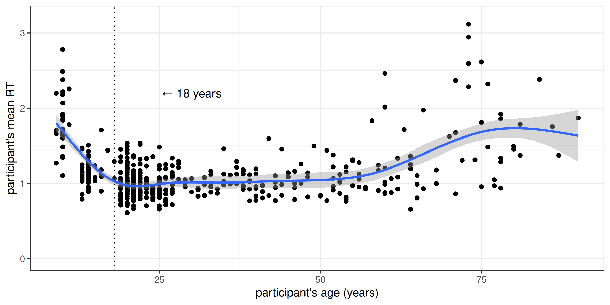
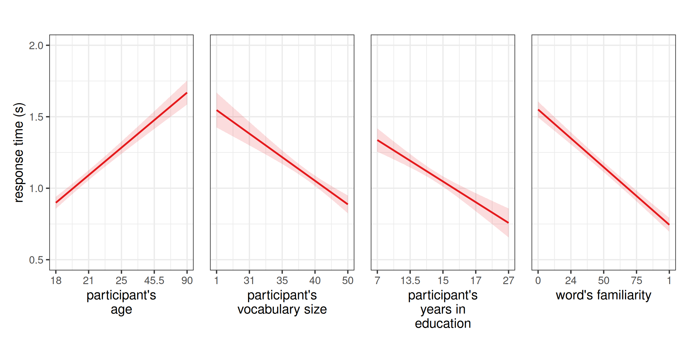

Supplementary Information: Older participants are slower in a visual
lexical decision task, but this is attenuated by a large vocabulary
================
Rácz, Péter
5 October, 2024

## Links

The code to run the experiments on Gitlab for pilot 1, pilot 2, and the
main experiment are
[**here**](https://gitlab.pavlovia.org/petyaraczbme/lex_span4),
[**here**](https://gitlab.pavlovia.org/petyaraczbme/lendulet_bme_szokiserlet_vegso),
and
[**here**](https://gitlab.pavlovia.org/petyaraczbme/lex-dec-task-random).

## File structure and workflow

We ran two pilot experiments and a main experiment. The stimulus list
for pilot 1 was based on a frequency list from [Hungarian Webcorpus
2](https://hlt.bme.hu/en/resources/webcorpus2). We host this list in
this repository. Cite us and the original if you want to use it.
Subsequent stimulus lists were based on results from pilot 1.

- src: corpus data in various processed forms
- raw: raw output of the Gitlab scripts running the experiments
- scripts: scripts to create the word lists, process the raw data,
  create the tidy data, and check on the processing
- tidy: tidy data for pilot 1, 2, and main
- analysis: scripts to analyse the tidy data from the main experiment

## Data dictionary for main data (tidy/d.tsv)

- id_spec: participant id with timestamp
- n_mistakes_for_nonce_words: n times participant said yes to non-word
- percent_mistakes_for_nonce_words: % participant said yes to non-word
- id: participant id
- data_type: did participant finish exp (they all did)
- participant_cap_2: counting participant vocab size v2
- participant_cap_1: counting participant vocab size v1
- max_trial_number: 250 for everyone
- max_block: 50 for everyone
- n_mistakes_for_real_words_total
- block
- n_mistakes_for_real_words_per_bin:n times part said no to real word
- yob: year of birth
- edu: years spent in education
- start: starting experiment
- exp: this is exp3
- row_number: row number in data
- block_trial_number: trial n 1-250 (only one block)
- trial_number: trial n 1-250
- word: target
- resp.keys: what key did part press
- resp.rt: part time \<- this is the outcome variable
- pos: target part of speech
- bin: target familiarity bin
- lfpm10r: log freq per 10 mil in Webcorpus 2, scaled
- nonce_word: this is a non-word
- correct: correct answer (y for word, n for non-word)
- link: link to exp
- missed_nonce_words: n non-words missed by part
- gender: part gender, self reported
- drop_participant: part meets exclusion criteria
- drop_observation: response meets exclusion criteria
- year_of_birth: year of birth tidy
- start_time: start time tidy
- start_year: start year
- age: year - yob
- answer: yes or no
- participant_age: age \<- predictor
- participant_vocabulary_size: vocab size \<- predictor
- word_familiarity: word familiarity bin \<- predictor

## Exclusion criteria

- drop_participant = missed_nonce_words \> 20
- drop_observation = resp.rt \> 4

## Stimulus info

| median_freq | mean_freq | median_lfreq | mean_lfreq | median_nchar | mean_nchar |
|------------:|----------:|-------------:|-----------:|-------------:|-----------:|
|        0.33 |     11.94 |         0.79 |      38.04 |            7 |       7.06 |

| pos       |   n |
|:----------|----:|
| adjective |  31 |
| noun      | 118 |
| verb      |  51 |

## Counts

| counts                       |      n |
|:-----------------------------|-------:|
| participants                 |    497 |
| observations                 | 124250 |
| participants, filtered       |    472 |
| observations, filtered       | 113076 |
| young participants, filtered |     80 |
| old participants, filtered   |    387 |

| response | real word | non word |
|:---------|----------:|---------:|
| no       |     18016 |     1977 |
| yes      |     72365 |    20718 |

    ## [1] "distribution of total response duration per participant:"

    ##       0%      25%      50%      75%     100% 
    ## 1.343503 2.352229 2.671501 3.074218 5.917920

## Factor analysis of age x vocabulary x education

    ## Factor Analysis using method =  minres
    ## Call: fa(r = vars, nfactors = 2, rotate = "varimax")
    ## Standardized loadings (pattern matrix) based upon correlation matrix
    ##         MR1  MR2   h2   u2 com
    ## s_age  0.10 0.38 0.15 0.85 1.2
    ## s_size 0.52 0.46 0.48 0.52 2.0
    ## s_edu  0.51 0.12 0.27 0.73 1.1
    ## 
    ##                        MR1  MR2
    ## SS loadings           0.54 0.37
    ## Proportion Var        0.18 0.12
    ## Cumulative Var        0.18 0.30
    ## Proportion Explained  0.59 0.41
    ## Cumulative Proportion 0.59 1.00
    ## 
    ## Mean item complexity =  1.4
    ## Test of the hypothesis that 2 factors are sufficient.
    ## 
    ## df null model =  3  with the objective function =  0.16 with Chi Square =  51.96
    ## df of  the model are -2  and the objective function was  0 
    ## 
    ## The root mean square of the residuals (RMSR) is  0 
    ## The df corrected root mean square of the residuals is  NA 
    ## 
    ## The harmonic n.obs is  326 with the empirical chi square  0  with prob <  NA 
    ## The total n.obs was  326  with Likelihood Chi Square =  0  with prob <  NA 
    ## 
    ## Tucker Lewis Index of factoring reliability =  1.062
    ## Fit based upon off diagonal values = 1
    ## Measures of factor score adequacy             
    ##                                                     MR1   MR2
    ## Correlation of (regression) scores with factors    0.63  0.54
    ## Multiple R square of scores with factors           0.40  0.29
    ## Minimum correlation of possible factor scores     -0.20 -0.42

## Model comparison

Three models fit on young and old data. lme4. ML. for main and resid
models, participant and word random intercept plus word familiarity
slope for participant. AIC, BIC, likelihood ratio test used for model
comparison. Models checked for collinearity using variance inflation
factor. (age and vocab size very collinear, so we decided not to test
interactions directly).

Young data: - Vocabulary: Is the vocabulary x age relationship linear or
polynomial? - Main: RT ~ part age, vocab size, word familiarity - Resid
Vocab/Age: RT ~ part age, variation in vocab size not explained by age
(residualised vocabulary size), word familiarity

``` r
# best models:

## -- young -- ##

## vocabulary
myv1 = lm(s_size ~ s_age, data = idsy)
## main
mys1 = lmer(resp.rt ~ 1 + s_age + s_word + s_size + (1+s_word|id) + (1|word), data = young, REML = F, control = lmerControl(optimizer="bobyqa", optCtrl=list(maxfun=20000)))
## residualised
myr1 = lmer(resp.rt ~ 1 + s_age + res_size_age + s_word + (1+s_word|id) + (1|word), data = young, REML = F, control = lmerControl(optimizer="bobyqa", optCtrl=list(maxfun=20000)))
```

Young data: - Vocabulary: Is the vocabulary x age relationship linear or
polynomial? - Main: RT ~ part age, vocab size, education, word
familiarity - Resid Vocab/Age: RT ~ part edu, age, variation in vocab
size not explained by age (residualised vocabulary size), word
familiarity - Resid Vocab/Edu: RT ~ part age, edu, variation in vocab
size not explained by edu (residualised vocabulary size), word
familiarity

``` r
# best models ctd.:

## -- old -- ##

## vocabulary
mov1 = lm(s_size ~ 1 + s_edu + s_age, data = idso)
## main
mos1 = lmer(resp.rt ~ 1 + s_age + s_edu + s_word + s_size + (1+s_word|id) + (1|word), data = old, REML = F, control = lmerControl(optimizer="bobyqa", optCtrl=list(maxfun=20000)))
## residualised
mor3 = lmer(resp.rt ~ 1 + s_edu + s_word + res_size_age * s_age + (1+s_word|id) + (1|word), data = old, REML = F, control = lmerControl(optimizer="bobyqa", optCtrl=list(maxfun=20000)))
mor4 = lmer(resp.rt ~ 1 + s_age + s_word + res_size_edu * s_edu + (1+s_word|id) + (1|word), data = old, REML = F, control = lmerControl(optimizer="bobyqa", optCtrl=list(maxfun=20000)))
```

## Tables in paper

| term        | estimate | std.error | statistic | conf.low | conf.high |
|:------------|---------:|----------:|----------:|---------:|----------:|
| (Intercept) |     2.58 |      0.10 |     25.42 |     2.38 |      2.78 |
| s_age       |   -10.31 |      1.64 |     -6.29 |   -13.52 |     -7.09 |
| s_word      |    -0.77 |      0.06 |    -12.94 |    -0.88 |     -0.65 |
| s_size      |    -0.47 |      0.24 |     -1.95 |    -0.94 |      0.00 |

| term        | estimate | std.error | statistic | conf.low | conf.high |
|:------------|---------:|----------:|----------:|---------:|----------:|
| (Intercept) |     2.10 |      0.07 |     29.74 |     1.97 |      2.24 |
| s_age       |     0.87 |      0.06 |     15.08 |     0.75 |      0.98 |
| s_edu       |    -0.70 |      0.10 |     -6.72 |    -0.90 |     -0.49 |
| s_word      |    -0.81 |      0.04 |    -20.23 |    -0.88 |     -0.73 |
| s_size      |    -0.66 |      0.09 |     -7.66 |    -0.83 |     -0.49 |

| term               | estimate | std.error | statistic | conf.low | conf.high |
|:-------------------|---------:|----------:|----------:|---------:|----------:|
| (Intercept)        |     1.67 |      0.06 |     28.79 |     1.55 |      1.78 |
| s_edu              |    -0.63 |      0.10 |     -6.50 |    -0.82 |     -0.44 |
| s_word             |    -0.81 |      0.04 |    -20.22 |    -0.88 |     -0.73 |
| res_size_age       |     0.26 |      0.14 |      1.82 |    -0.02 |      0.53 |
| s_age              |     0.70 |      0.05 |     13.19 |     0.60 |      0.80 |
| res_size_age:s_age |    -2.15 |      0.27 |     -7.93 |    -2.68 |     -1.62 |

| term               | estimate | std.error | statistic | conf.low | conf.high |
|:-------------------|---------:|----------:|----------:|---------:|----------:|
| (Intercept)        |     1.76 |      0.06 |     29.39 |     1.64 |      1.88 |
| s_age              |     0.85 |      0.06 |     14.94 |     0.74 |      0.97 |
| s_word             |    -0.81 |      0.04 |    -20.23 |    -0.88 |     -0.73 |
| res_size_edu       |    -1.48 |      0.30 |     -5.01 |    -2.06 |     -0.90 |
| s_edu              |    -0.90 |      0.10 |     -8.96 |    -1.10 |     -0.70 |
| res_size_edu:s_edu |     1.65 |      0.57 |      2.90 |     0.54 |      2.77 |

## Plots in paper

<!-- --><!-- --><!-- --><!-- --><!-- -->
